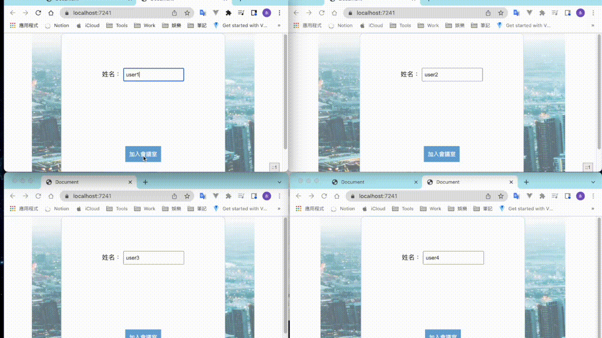
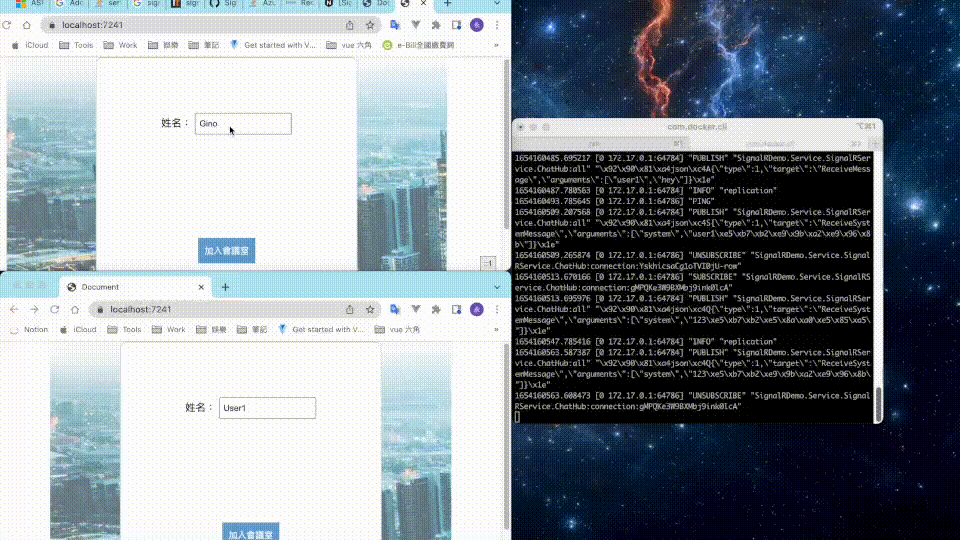

# SignalR Demo
-----

``` C#
    <PackageReference Include="Microsoft.AspNetCore.SignalR.Core" Version="1.1.0" />
    <PackageReference Include="Microsoft.AspNetCore.SignalR.StackExchangeRedis" Version="6.0.5" />
 
```

--- 

###  學習 Real Time Web  , 利用SignalR功能實作聊天室


--- 

###  應對分散伺服器架構使用Redis 作爲交換訊息的資料中樞


---

# 建立redis server

```docker
docker pull redis

docker run --name redis-lab -p 6379:6379 -d redis
```
``` bash
redis-cli 

monitor //查看即時紀錄訊息
```
